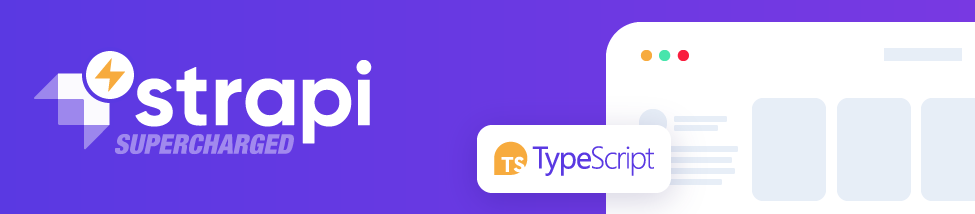

<!-- PROJECT SHIELDS -->

[![Contributors][contributors-shield]][contributors-url]
[![Forks][forks-shield]][forks-url]
[![Stargazers][stars-shield]][stars-url]
[![Issues][issues-shield]][issues-url]
[![MIT License][license-shield]][license-url]
[![LinkedIn][linkedin-shield]][linkedin-url]

<!-- PROJECT LOGO -->
<br />
<p align="center">
  <a href="https://github.com/digisquad-io/strapi-supercharged">
    
  </a>

  <h3 align="center">Strapi Supercharged</h3>

  <p align="center">
    Supercharge your Strapi applications and plugins with typescript compiler
    <br />
    <a href="https://github.com/digisquad-io/strapi-supercharged"><strong>Explore the docs »</strong></a>
    <br />
    <br />
    <a href="https://github.com/digisquad-io/strapi-supercharged-template">View Template</a>
    ·
    <a href="https://github.com/digisquad-io/strapi-supercharged/issues">Report Bug</a>
    ·
    <a href="https://github.com/digisquad-io/strapi-supercharged/issues">Request Feature</a>
  </p>
</p>

<!-- TABLE OF CONTENTS -->
<details open="open">
  <summary><h2>Table of Contents</h2></summary>
  <ol>
    <li>
      <a href="#about-the-project">About The Project</a>
      <ul>
        <li><a href="#javascript-as-typescript-code">“Javscript as Typescript” code</a></li>
        <li><a href="#-goals">Goals</a></li>
      </ul>
    </li>
    <li>
      <a href="#getting-started">Getting Started</a>
      <ul>
        <li><a href="#prerequisites">Prerequisites</a></li>
        <li><a href="#installation">Installation</a></li>
      </ul>
    </li>
    <li>
      <a href="#usage">Usage</a>
      <ul>
        <li><a href="#-declare-your-models">Declare your Models</a></li>
        <li><a href="#-register-api-typing">Register API typing</a></li>
        <li><a href="#-register-plugins-typing">Register Plugins typing</a></li>
        <li><a href="#-use-your-supercharged-strapi">Use your Supercharged Strapi</a></li>
        <li><a href="#-packagejson-scrips">`package.json` scrips</a></li>
        <li><a href="#-docker-utils">docker utils</a></li>
      </ul>
    </li>
    <li><a href="#-roadmap">Roadmap</a></li>
    <li><a href="#%EF%B8%8F-contributing">Contributing</a></li>
    <li><a href="#license">License</a></li>
    <li><a href="#contact">Contact</a></li>
    <li><a href="#acknowledgements">Acknowledgements</a></li>
  </ol>
</details>

<!-- GETTING STARTED -->

## Getting Started

To get a local copy up and running follow these simple steps.

### Installation to an existing project

1. Install `strapi-supercharged` and `typescript` dev dependencies
   ```sh
   npm install --save-dev strapi-supercharged typescript # yarn add -D strapi-supercharged typescript
   ```
2. Create a `tsconfig.json`
   ```json
   {
     "compilerOptions": {
       "lib": ["esnext"],
       "target": "ES1019",
       "moduleResolution": "node",
       "esModuleInterop": true,
       "resolveJsonModule": true,
       "allowJs": true,
       "checkJs": true,
       "strict": true,
       "strictNullChecks": true,
       "noImplicitAny": true,
       "baseUrl": ".",
       "noEmit": true,
       "declaration": false,
       "types": ["strapi-supercharged"]
     },
     "include": ["**/*.js", ".eslintrc.js"]
   }
   ```

### Installation from template

1. Clone the repo
   ```sh
   git clone https://github.com/digisquad-io/strapi-supercharged-template.git
   ```
   > 🚀 **[Or use `strapi-supercharged-template`](https://github.com/digisquad-io/strapi-supercharged-template/generate)**
2. Install NPM packages
   ```sh
   npm install # yarn
   ```
3. Run the tests
   ```sh
   npm test # yarn test
   ```

<!-- ABOUT THE PROJECT -->

## About The Project

### “Javascript as Typescript” code

Use all power of Typescript directly into your Javascript

[![Predict all types from internal and custom methods][preview-api-content]](https://github.com/digisquad-io/strapi-supercharged-template/tree/main/api/article/controllers/article.js "Predict all types from internal and custom methods")

> **Predict all types from internal and custom methods**

[![Autocomplete built in and custom methods][built-in-and-custom-methods]](https://github.com/digisquad-io/strapi-supercharged-template/tree/main/api/article/controllers.d.ts "Autocomplete built in and custom methods")

> **Autocomplete built in and custom methods**

[![Autocomplete for your models in query][query-autocompletion]](https://github.com/digisquad-io/strapi-supercharged-template/tree/main/api/article/controllers.d.ts "Autocomplete for your models in query")

> **Autocomplete for your models in query**

[![Embed documentation & improved configuration][built-in-configuration-documentation]](https://github.com/digisquad-io/strapi-supercharged-template/tree/main/config/middlewares.js "Embed documentation & improved configuration")

> **Embed documentation & improved configuration**

[![Advanced linter configuration][preview-improved-linters]](https://github.com/digisquad-io/strapi-supercharged-template/tree/main/scripts/empty-script.js "Advanced linter configuration")

> **Advanced linter configuration**

[![Advanced error detection][static-error-checking]](https://github.com/digisquad-io/strapi-supercharged-template "Advanced error detection")

> **Advanced error detection**

### 🎯 Goals

- Cover **API**, **Plugins** and all **Internal Strapi** typing
- **Ahead-Of-Time** compilation errors with **Typescript**
- Highly **extensible** definitions with interface merging

<!-- USAGE EXAMPLES -->

## Usage

### 💡 Declare your Models

> @todo

_For complete examples, please refer to the [Article API model typing](https://github.com/digisquad-io/strapi-supercharged-template/tree/main/api/article/models/article.d.ts) or the [Product model typing from sample plugin](https://github.com/digisquad-io/strapi-supercharged-template/tree/main/plugins/sample/models/product.d.ts)_

### 💡 Register API typing

> @todo

_For a complete example, please refer to the [ArticleAPI typing](https://github.com/digisquad-io/strapi-supercharged-template/tree/main/api/article/index.d.ts)_

### 💡 Register Plugins typing

> @todo

_For a complete example, please refer to the [SamplePlugin typing](https://github.com/digisquad-io/strapi-supercharged-template/tree/main/plugins/sample/index.d.ts)_

### 🌠 Use your Supercharged Strapi

#### In controllers

> @todo

_For a complete example, please refer to the [Article controller](https://github.com/digisquad-io/strapi-supercharged-template/tree/main/api/article/controllers/article.js)_

#### In services

> @todo

_For a complete example, please refer to the [Article service](https://github.com/digisquad-io/strapi-supercharged-template/tree/main/api/article/services/article.js)_

#### In middlewares

> @todo

_For a complete example, please refer to the [Sample middleware (from sample plugin)](https://github.com/digisquad-io/tree/main/strapi-supercharged-template/plugins/sample/middlewares/sample.js)_

#### In scripts

> @todo

_For a complete example, please refer to the [`scripts/initData.js` demo script](https://github.com/digisquad-io/strapi-supercharged-template/tree/main/scripts/initData.js)_

<!-- CONTRIBUTING -->

## 🙋‍♂️ Contributing

Contributions are what make the open source community such an amazing place to be learn, inspire, and create. Any contributions you make are **greatly appreciated**.

1. Fork the Project
2. Create your Feature Branch (`git checkout -b feature/amazing-feature`)
3. Commit your Changes (`git commit -m 'feat(amazing-feature): add something amazing'`)
4. Push to the Branch (`git push origin feature/amazing-feature`)
5. Open a Pull Request

> :octocat: **tip**: try to use <kbd>.</kbd> keyboard shortcut on this repository _(or <kbd>shift</kbd>+<kbd>;</kbd>)_

<!-- LICENSE -->

## License

Distributed under the MIT License. See `LICENSE.md` for more information.

<!-- CONTACT -->

## Contact

digisquad.io - contact@digisquad.io

<!-- ACKNOWLEDGEMENTS -->

## Acknowledgements

- [Strapi](https://github.com/strapi/strapi)

<!-- MARKDOWN LINKS & IMAGES -->
<!-- https://www.markdownguide.org/basic-syntax/#reference-style-links -->

[contributors-shield]: https://img.shields.io/github/contributors/digisquad-io/strapi-supercharged.svg?style=for-the-badge
[contributors-url]: https://github.com/digisquad-io/strapi-supercharged/graphs/contributors
[forks-shield]: https://img.shields.io/github/forks/digisquad-io/strapi-supercharged.svg?style=for-the-badge
[forks-url]: https://github.com/digisquad-io/strapi-supercharged/network/members
[stars-shield]: https://img.shields.io/github/stars/digisquad-io/strapi-supercharged.svg?style=for-the-badge
[stars-url]: https://github.com/digisquad-io/strapi-supercharged/stargazers
[issues-shield]: https://img.shields.io/github/issues/digisquad-io/strapi-supercharged.svg?style=for-the-badge
[issues-url]: https://github.com/digisquad-io/strapi-supercharged/issues
[license-shield]: https://img.shields.io/github/license/digisquad-io/strapi-supercharged.svg?style=for-the-badge
[license-url]: https://github.com/digisquad-io/strapi-supercharged/blob/master/LICENSE.txt
[linkedin-shield]: https://img.shields.io/badge/-LinkedIn-black.svg?style=for-the-badge&logo=linkedin&colorB=555
[linkedin-url]: https://linkedin.com/company/digisquad-io
[preview-api-content]: ./.github/images/preview-api-content.png
[preview-improved-linters]: ./.github/images/preview-improved-linters.png
[built-in-and-custom-methods]: ./.github/images/built-in-and-custom-methods.png
[built-in-configuration-documentation]: ./.github/images/built-in-configuration-documentation.png
[query-autocompletion]: ./.github/images/query-autocompletion.png
[static-error-checking]: ./.github/images/static-error-checking.png
